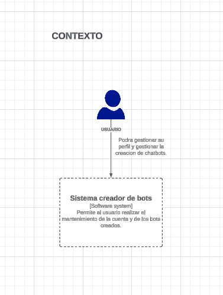

# Proyecto: Desarrollo de Chatbots con IA para Empresas y PYMES

| Nombre                       | Código     |
|------------------------------|------------|
| Chambilla Zuñiga, Josue      | 2020067575 |
| Rivera Mendoza, Jhonny       | 2020067144 |
### Herramientas y lenguajes:
#### Servicio WEB
   - Python con flask.
   - MYSQL.
#### Servicio Creador de bots
   - C# con webapi .NET 8.
   - Paquete de chatbot whatsapp.
   - Docker (para cada servicio incluyendo el bot).
### Metodologia
Para este proyecto se eligio la metodologia SCRUM, no se aplico al 100%, ya que aun estamos en etapa de recoleccion.
## Avance Semana 1:

### Introduccion a chatbots
Cada miembro del equipo realizo una investigacion para entender el funcionamiento de los chatbots, para esto se les pidio lo siguiente:
- Investigar repositorios sobre chatbots.
- Que es un chatbot.
- Como se da la implementacion de un chatbot.
- Realizar una demostracion de todo lo aprendido.

Resultados:
Se hizo una prueba con los siguientes servicios de creacion de chatbots, con el fin de entender su proceso de creacion.
1. Voiceflow:
   - Se realizo un arbol de dialogo(flujos)

2. Poe
   - Creacion del bot
   
   - Uso del bot
   
3. WhatsAPP Chatbot
   - Documentacion bot whatsapp
   https://bot-whatsapp.netlify.app/
   - 
### Diagramas
1. Primera propuesta, usando voiceflow y el paquete de chatbot

2. Segunda propuesta, se hizo una simulacion para la creacion de chatbots en contenedores docker, con el fin de automatizar la creacion de estos.

## Avance Semana 2:
### Investigacion de chatbots
Debido a que la investigacion de la semana 1 no se dio de forma correcta, se dio plazo para investigar acerca de la creacion de estos.
- Averiguar repositorios de chatbots
- Investigar el funcionamiento de estos para entrar a contexto
- Realizar una demostracion de un chatbot

Resultados:
De momento se tiene un pequeño avance, ya que aun no entramos a la reunion semana que se da cada viernes
### Diagramas
Se fue avanzando el modelo a usar para la creacion de los chatbots
- Creacion de chatbots usando un paquete de chatbots

- Segundo modelo para la creacion de chatbots

## Avance Semana 3:

Esta semana se avanzo con los diagramas y se definio la estructura del proyecto final.

#### Casos de uso:

#### Estructura de servicios y formato del formulario

#### Diagrama C4
##### Contexto
